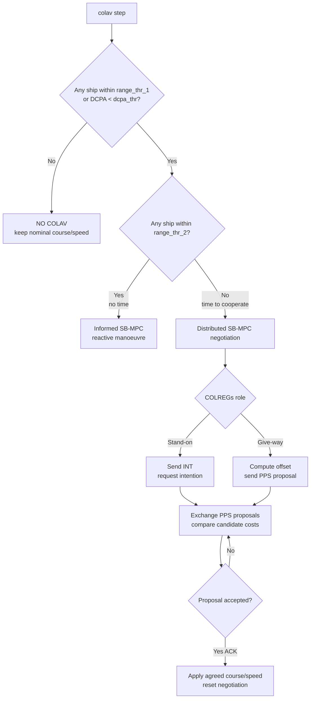

# Informed SB-MPC (IFAC 2022) — Collaborative Ship Collision Avoidance

Prototype implementation of **Informed Scenario-Based Model Predictive Control (SB-MPC)** with
**collaborative (negotiated) collision avoidance** for autonomous surface ships, built on
**ROS 1**. Multiple ship agents broadcast their states, and when an encounter arises they
negotiate COLREGs-compliant evasive manoeuvres via direct ship-to-ship messaging.

This is the simplified prototype (2–3 ships, abstract head-on / crossing encounters) that
accompanies the paper below.

---

## Related publication

> M. Akdağ, T. I. Fossen, and T. A. Johansen,
> **"Collaborative Collision Avoidance for Autonomous Ships Using Informed Scenario-Based
> Model Predictive Control,"** *IFAC-PapersOnLine*, vol. 55, no. 31, pp. 249–256, 2022.
> DOI: [10.1016/j.ifacol.2022.10.439](https://doi.org/10.1016/j.ifacol.2022.10.439)
> (IFAC CAMS 2022; funded by the Research Council of Norway, grant 308839.)

---

## What it does

- A central **`server`** node fuses each ship's broadcast state into a shared situational
  awareness picture and re-broadcasts it.
- Each **`ship`** node (`ship1`–`ship3`) follows waypoints and runs the COLAV decision layer:
  - **Informed SB-MPC** — reactive scenario-based avoidance informed by other ships' intent.
  - **Distributed SB-MPC** — cooperative avoidance negotiated between ships.
  - **Negotiation protocol** — ships exchange proposed manoeuvres via the `DirectMessage`
    ROS service until they agree.

**State vector convention** (JSON-encoded on the wire):
```
[t, id, x, y, psi, u, v, r, r18, wps]
```

---

## Logical flow

Every control step, each ship node runs `colav()` ([`src/colav.py`](src/colav.py)), which
picks between *no action*, *reactive avoidance*, and *cooperative negotiation* based on the
proximity of the target ships.

**Decision thresholds** (from `colav()`):

| Symbol | Value | Meaning |
| --- | --- | --- |
| `range_thr_1` | 4000 | Outer range: below this a collision risk is considered. |
| `range_thr_2` | 1800 | Collaboration cutoff: inside this there is no time to negotiate. |
| `dcpa_thr` | 1000 | Distance to Closest Point of Approach risk threshold. |
| `tcpa_thr` | 100 | Time to Closest Point of Approach threshold. |

**Step-by-step:**

1. **Risk check.** If every target ship is farther than `range_thr_1` *or* every DCPA is
   above `dcpa_thr`, there is no risk → keep the nominal course/speed (`NO COLAV`).
2. **Risk exists** (any distance `< range_thr_1` or any DCPA `< dcpa_thr`):
   - **Too close to negotiate** (any distance `< range_thr_2`): run **Informed SB-MPC**
     (`sbmpc.get_optimal_ctrl_offset`) for an immediate reactive manoeuvre informed by the
     other ships' communicated intent (`INFORMED SBMPC IS ACTIVE`).
   - **Time to cooperate** (all distances `≥ range_thr_2`): run **Distributed SB-MPC**
     negotiation via the `DirectMessage` service:
     - A **stand-on** ship (`CR-SO` / `ON-SO` / `HO-GW`) asks the other ship's intention
       with an `INT` message.
     - A **give-way** ship computes its optimal offset (`dsbmpc.get_optimal_ctrl_offset`)
       and sends it as a proposal (`PPS`).
     - On each received `PPS`, the ship evaluates three candidate costs (cooperate with the
       peer's proposal, counter-propose, or hold) and either sends a better `PPS` or accepts
       with `ACK`.
     - Once a proposal is acknowledged (`ACK`), both ships apply the agreed course/speed and
       reset the negotiation for the next encounter.



---

## Repository layout

```
CMakeLists.txt          catkin build config (declares msgs/srvs)
package.xml             ROS package manifest
msg/                    ROS messages: ship_states, bcast_sitaw, rtx_msg
srv/                    ROS services: DirectMessage, RTXmsg
src/
  server.py             central situational-awareness node
  ship1.py ship2.py ship3.py   ship agent nodes
  config.py             sim settings + head-on / crossing scenarios
  ship_model.py         vessel kinematics + LOS guidance
  sbmpc.py              Scenario-Based MPC
  dsbmpc.py             Distributed SB-MPC + negotiation (answer_request)
  colav.py              top-level COLAV decision maker
  map_polygons.py       land polygons for grounding checks
  utility.py            helpers (angles, distances, ROS pub/sub)
  mass_sim.launch       launch file: server + ships
```

---

## Dependencies

**ROS 1** (rospy, catkin) — `rospy` and the `informed_sbmpc.msg` / `informed_sbmpc.srv` modules
come from the ROS install and the catkin build, **not** pip.

**Python (pip):** see [`requirements.txt`](requirements.txt) — `numpy`, `pandas`,
`matplotlib`, `shapely`.

```bash
pip install -r requirements.txt
```

---

## Build & run (ROS 1 / catkin)

```bash
# 1) Place under a catkin workspace, e.g. ~/catkin_ws/src/informed_sbmpc
# 2) Python deps
pip install -r requirements.txt
# 3) Build
cd ~/catkin_ws
catkin_make            # or: catkin build
source devel/setup.bash
# 4) Master
roscore
# 5) Launch server + ships
roslaunch informed_sbmpc mass_sim.launch
```

Individual nodes:

```bash
rosrun informed_sbmpc server.py
rosrun informed_sbmpc ship1.py
rosrun informed_sbmpc ship2.py
```

---

## Glossary

- **COLREGs** — International Regulations for Preventing Collisions at Sea.
- **SB-MPC** — Scenario-Based Model Predictive Control.
- **Informed SB-MPC** — SB-MPC informed by other vessels' communicated intentions.
- **Distributed SB-MPC** — cooperative, negotiated variant.
- **LOS** — Line-of-Sight waypoint guidance.
- **DCPA / TCPA** — Distance / Time to Closest Point of Approach.
